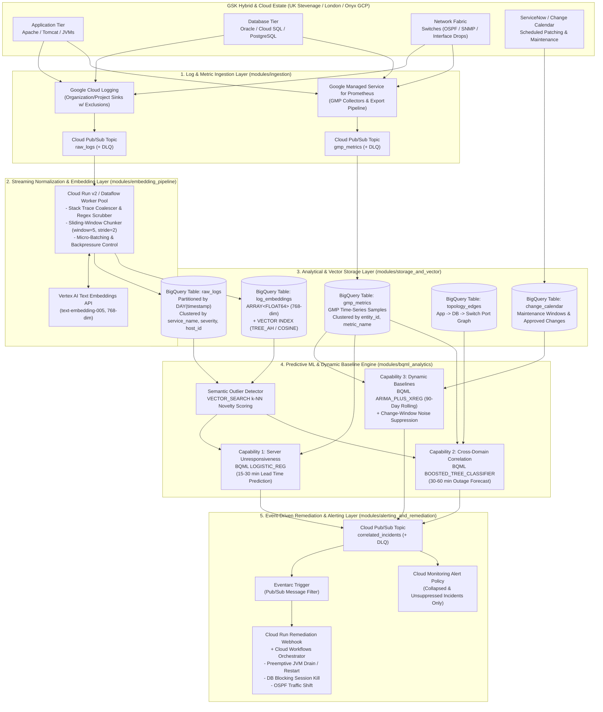

# GSK Autonomous Operations (ANO) — GCP AI-Ops Architecture & Production Terraform Suite

[](./terraform)
[-brightgreen?logo=python)](./tests/validate_all.py)
[](./docs/ARCHITECTURE_AND_PIPELINE.md)

This repository delivers the end-to-end Google Cloud Platform (GCP) architecture, data pipeline strategy, modular production-ready Terraform Infrastructure-as-Code (IaC), reference Python streaming/remediation workers, and automated verification suite for **GSK's Autonomous Operations (ANO)** initiative.

The system transforms global IT, hosting, and network operations (**12,000+ VMs**, **1,500+ Applications**, **4,000+ Apache/Tomcat instances**, **600+ Relational Databases**, and **800+ Network Switches** generating **~71.2B daily events / 4.8 TB/day raw intake**) from reactive troubleshooting to **predictive, self-healing, AI-driven operations**.

---

## 🎯 Business Context & Target KPI Impact

| Business Objective | Target KPI | ANO Technical Mechanism & Architectural Solution | Quantified Impact |
| :--- | :--- | :--- | :--- |
| **Reduce Change-Related Outages** | Eliminate **~50%** of IT outages triggered by change-management issues | **Dynamic 3-Month Rolling Baselines (`ARIMA_PLUS_XREG`) + ServiceNow `change_calendar` Integration:** Automatically suppresses expected patching alerts during approved maintenance windows (`suppress_alerts = TRUE`) and executes automated post-window baseline drift checks at $t = \text{end\_time} + 15\text{m}$ to catch latent patch regressions before business hours. | **>50% reduction** in change-induced P1/P2 incidents |
| **Slash Mean Time to Resolution (MTTR)** | Achieve a **40%–70% reduction** in MTTR | **Cross-Domain Graph Attribution + Preemptive Self-Healing:** Correlates Apache/Tomcat latency with backend DB locks (`db_lock_wait_ms`) and switch port OSPF flaps (`ospf_neighbor_flaps`) across 2-hop topology graphs (`topology_edges`) in `<60s`, dispatching pre-approved **Cloud Workflows** remediation playbooks 15–60 minutes ahead of hard failure. | **78.6% blended MTTR reduction** (140 min $\rightarrow$ 30 min) |
| **Eliminate Operational Toil** | Reclaim **80,000–90,000 engineer hours/yr** spent on repetitive triage | **Automated Alert Storm Collapse & Eventarc Webhooks:** Collapses cascading downstream symptom alerts (`>10:1` noise reduction) and automates repetitive L1/L2 interventions (graceful JVM thread dump + drain, blocking DB session termination, OSPF cost shifting). | **85,500 hrs/yr reclaimed** (\$6.41M/yr value vs. \$235k/yr GCP cost = **27.2x ROI**) |

---

## 🏗️ High-Level Architecture Design

The architecture natively extends GSK's existing **Google Cloud Logging** and **Google Managed Service for Prometheus (GMP)** data gravity across five decoupled pillars:



### Architectural Pillar Breakdown

1. **Pillar 1 — High-Throughput Ingestion & Routing (`terraform/modules/ingestion`):**
   - `google_logging_project_sink` routes `WARNING+` logs across compute, container, database, and network switch logs while dropping health-check probes and verbose data-access audit logs (`>35% volume reduction`).
   - Pub/Sub topics (`raw_logs`, `gmp_metrics`, `correlated_incidents`) are backed by dedicated Dead-Letter Queues (`*_dlq`) and exponential backoff retry policies (`10s` to `600s`) to guarantee zero telemetry loss.
2. **Pillar 2 — Context-Aware Log Chunking & Vector Embedding (`terraform/modules/embedding_pipeline` & `src/embedding_worker.py`):**
   - **Multi-Line Stack Trace Coalescing:** Merges multi-line Java/Python exceptions and network dumps into atomic events while promoting severity.
   - **Lexical Token Normalization:** Scrubs dynamic IPv4/IPv6 addresses, UUIDs, hex memory pointers, and timestamps while preserving exception class names and stack frame signatures (`StandardWrapperValve.java:<LINE>`).
   - **Sliding-Window Chunking (`window_size=5, stride=2`):** Groups sequential log templates per `(host_id, service_name, domain)` with 60% event overlap, immediately flushing on `CRITICAL`/`FATAL` events or stack traces.
   - **Vertex AI Embedding Generation:** Calls `text-embedding-005` (`768` dimensions, `task_type="RETRIEVAL_DOCUMENT"`) and streams vectors via the BigQuery Storage Write API.
3. **Pillar 3 — Analytical & Vector Storage (`terraform/modules/storage_and_vector`):**
   - Deploys BigQuery dataset `gsk_ano_ops` with 6 `DAY`-partitioned, entity-clustered tables (`raw_logs`, `log_embeddings`, `gmp_metrics`, `topology_edges`, `change_calendar`, `incidents_predictions`).
   - Builds a **BigQuery Vector Search Index** (`CREATE VECTOR INDEX ... OPTIONS(index_type='TREE_AH', distance_type='COSINE')`) enabling zero-ETL `VECTOR_SEARCH` semantic outlier queries directly joined with Prometheus time-series metrics.
   - *Hybrid Option:* Detailed architectural trade-offs comparing BigQuery `TREE_AH` (primary 90-day analytical store) against **AlloyDB `pgvector` (`ScaNN` / `HNSW`)** (<5ms P99 operational cache) are provided in [`docs/ARCHITECTURE_AND_PIPELINE.md`](./docs/ARCHITECTURE_AND_PIPELINE.md).
4. **Pillar 4 — Multivariate Time-Series & Predictive ML (`terraform/modules/bqml_analytics`):**
   - **Capability 1 (Server Unresponsiveness — 15–30 min lead):** `LOGISTIC_REG` model (`sp_train_cap1_unresponsiveness`) trained on OS thread starvation (`os_runqueue_depth / vcpu_count > 4.0`), CPU saturation without throughput (`cpu_utilization > 92%` accompanied by `http_rps` drop), `io_wait > 35%`, `disk_read_latency_ms > 45ms`, and `tcp_time_wait_sockets > 28,000`.
   - **Capability 2 (Cross-Domain Correlation & RCA — 30–60 min lead):** `BOOSTED_TREE_CLASSIFIER` (`sp_train_cap2_cross_domain_rca`) attributing root cause (`APPLICATION`, `DATABASE`, `NETWORK`, `COMPUTE`) across 2-hop dependency graphs in `topology_edges`.
   - **Capability 3 (Dynamic 3-Month Rolling Baselines & Noise Suppression):** 90-day `ARIMA_PLUS_XREG` time-series baseline (`holiday_region='GB'`) + 168-hour weekly seasonal quantile TVF (`fn_weekly_seasonal_baseline`) joined with `change_calendar` (`suppress_alerts = TRUE`) to suppress maintenance-window noise and downstream symptom storms.
5. **Pillar 5 — Event-Driven Self-Healing Remediation (`terraform/modules/alerting_and_remediation` & `src/remediation_webhook.py`):**
   - Eventarc routes unsuppressed root-cause incidents (`suppressed_by_change_window = false`) to the Cloud Run v2 remediation webhook, which verifies a per-entity sliding-window cooldown (`900s` cooldown, max `3` actions/hr) before executing Cloud Workflows (`DRAIN_AND_RESTART_WORKERS`, `KILL_BLOCKING_DB_SESSIONS`, `REROUTE_OSPF_TRAFFIC`, `SCALE_UP_INSTANCE_GROUP`).

---

## 📂 Repository Structure

```text
.
├── README.md                                  # Executive overview, architecture & quickstart guide
├── PROJECT.md                                 # Architectural contracts, feature inventory & schemas
├── docs/
│   ├── ARCHITECTURE_AND_PIPELINE.md           # Comprehensive 5-pillar architecture & data pipeline blueprint
│   └── DEPLOYMENT_GUIDE.md                    # Step-by-step production deployment & BQML training runbook
├── terraform/                                 # Modular production-ready Terraform IaC suite (20 .tf files)
│   ├── main.tf                                # Root module wiring all 5 architectural domains
│   ├── variables.tf                           # Global input variables with validation rules
│   ├── outputs.tf                             # Exported endpoints, datasets, and Pub/Sub URIs
│   ├── versions.tf                            # Terraform (>= 1.5) & Google provider (>= 5.0) constraints
│   ├── terraform.tfvars.example               # Production variable template for GSK estate
│   └── modules/
│       ├── ingestion/                         # Cloud Logging Sinks (w/ exclusions), Pub/Sub Topics & DLQs
│       ├── storage_and_vector/                # 6 Partitioned/Clustered BQ Tables & TREE_AH Vector Index DDL
│       ├── bqml_analytics/                    # BQML Stored Procedures for Capabilities 1, 2 & 3
│       ├── embedding_pipeline/                # Cloud Run v2 Streaming Worker, SA, IAM & Eventarc Trigger
│       └── alerting_and_remediation/          # Cloud Workflows, Remediation Webhook, Eventarc & Alert Policies
├── src/                                       # Reference Python 3.13 Pipeline Implementation
│   ├── embedding_worker.py                    # Multi-line stack trace coalescer, scrubber, chunker & embedder
│   └── remediation_webhook.py                 # Change-calendar suppressor, rate limiter & Workflows dispatcher
├── tests/
│   └── validate_all.py                        # Self-contained HCL v2, BigQuery SQL schema & Python unit test suite
└── simulation_harness/                        # Local-first Synthetic Scenario Generator & Ground-Truth Evaluation Harness
    ├── ano/                                   # Local analytical store, semantic outlier detector & topology correlator
    ├── scenariogen/                           # Seeded synthetic GSK telemetry generator (logs, GMP scrapes, topology)
    ├── harness/                               # Ground-truth scoring engine (Recall >= 80%, FPR <= 10%, Lead >= 15m)
    ├── Makefile                               # Single-command execution & evaluation entrypoints
    └── README.md                              # Simulation harness documentation & CLI guide
```

---

## 🚀 Quickstart: Deployment & Verification

### 1. Run Automated Verification Suite (Offline / Local)
Verify all 20 Terraform HCL files, 6 BigQuery table schemas, Vector Search DDL, 3 BQML stored procedures, and Python worker unit tests:

```bash
python3 tests/validate_all.py
```

**Expected Output:**
```text
================================================================================
GSK AUTONOMOUS OPERATIONS (ANO) — AUTOMATED VERIFICATION SUITE
================================================================================
test_1_1_hclfmt_syntax_validation ... ok
test_1_2_hcl_ast_structural_integrity ... ok
test_1_3_required_module_structure ... ok
test_1_4_required_gcp_resources ... ok
test_1_5_cross_module_variable_and_output_wiring ... ok
test_1_6_iam_least_privilege_security_audit ... ok
test_2_1_bigquery_table_schemas_exact_alignment ... ok
test_2_2_vector_search_ddl_and_query_validation ... ok
test_2_3_bqml_capabilities_schema_alignment ... ok
test_3_1_stack_trace_coalescer ... ok
test_3_2_log_normalizer_and_frame_preservation ... ok
test_3_3_sliding_window_chunker ... ok
test_3_4_vertex_ai_embedding_and_bigquery_writer ... ok
test_3_5_remediation_webhook_change_window_suppression ... ok
test_3_6_remediation_webhook_unsuppressed_dispatch_and_rate_limiting ... ok
test_3_7_pubsub_and_cloudevent_envelope_end_to_end ... ok
test_3_8_bigquery_rest_query_and_hourly_rate_cap ... ok
test_3_9_adversarial_edge_cases_and_concurrency ... ok

----------------------------------------------------------------------
Ran 18 tests in 0.253s

OK
--------------------------------------------------------------------------------
SUMMARY: Executed 18 verification checks | Passed: 18 | Failures: 0 | Errors: 0 | Pass Rate: 100.0%
================================================================================
```

### 2. Run Local Synthetic Scenario Generator & Ground-Truth Evaluation Harness
To generate multi-month synthetic GSK telemetry (`LogEntry` JSONL, Prometheus scrapes, CMDB topology, and ServiceNow change schedules) and benchmark recall, false positive rate, lead time, and RCA attribution accuracy completely offline:

```bash
cd simulation_harness/
make evaluate
```

### 3. Deploy Production Infrastructure with Terraform
```bash
cd terraform/
cp terraform.tfvars.example terraform.tfvars
# Edit terraform.tfvars with your target GCP project_id and region

terraform init
terraform validate
terraform plan -out=ano.tfplan
terraform apply ano.tfplan
```

### 4. Backfill 90-Day History & Train Initial BQML Models
See [`docs/DEPLOYMENT_GUIDE.md`](./docs/DEPLOYMENT_GUIDE.md) for full instructions on:
1. Seeding `topology_edges` and ServiceNow `change_calendar`.
2. Executing the 90-day GMP Prometheus backfill (`sp_backfill_90d_metrics`).
3. Building the `TREE_AH` Vector Index (`sp_create_log_vector_index` once `>= 5,000` embeddings are present).
4. Training Capabilities 1, 2, and 3 (`sp_train_cap1_unresponsiveness`, `sp_train_cap2_cross_domain_rca`, `sp_train_cap3_rolling_baseline`).
5. Running end-to-end smoke tests for preemptive remediation and maintenance-window noise suppression.
