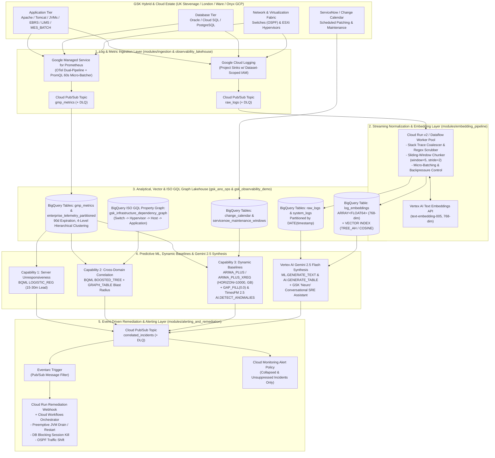

# GSK Autonomous Operations (ANO) — GCP AI-Ops Architecture & Production Terraform Suite

[](./terraform)
[-brightgreen?logo=python)](./tests/validate_all.py)
[](./docs/CUSTOMER_DEMO_RUNBOOK.md)
[](./docs/GSK_OBSERVABILITY_PLATFORM_ARCHITECTURE.md)
[](./docs/ARCHITECTURE_AND_PIPELINE.md)

This repository delivers the end-to-end Google Cloud Platform (GCP) architecture, data pipeline strategy, modular production-ready Terraform Infrastructure-as-Code (IaC), OpenTelemetry Collector configuration, SQL/DDL/ISO GQL catalog, reference Python streaming/remediation/micro-batching workers, interactive **"Neuro" Conversational AI SRE Workbench**, and automated 30-test verification suite for **GSK's Autonomous Operations (ANO) & Enterprise Observability Platform** initiative.

The system transforms global IT, hosting, pharmaceutical manufacturing (**EBRS**, **LIMS**, **MES_BATCH** across `Site_A_London`, `Site_B_Stevenage`, and `Site_C_Ware`), and network operations (**12,000+ VMs**, **1,500+ Applications**, **4,000+ Apache/Tomcat instances**, **600+ Relational Databases**, and **800+ Network Switches** generating **~71.2B daily events / 4.8 TB/day raw intake**) from reactive troubleshooting to **predictive, self-healing, AI-driven operations**.

---

## 🎯 Business Context & Target KPI Impact

| Business Objective | Target KPI | ANO Technical Mechanism & Architectural Solution | Quantified Impact |
| :--- | :--- | :--- | :--- |
| **Reduce Change-Related Outages** | Eliminate **~50%** of IT outages triggered by change-management issues | **Dynamic 3-Month Rolling Baselines (`ARIMA_PLUS_XREG`) + ServiceNow `change_calendar` / `servicenow_maintenance_windows` Integration:** Automatically suppresses expected patching alerts during approved maintenance windows (`suppress_alerts = TRUE` / `is_maintenance_window = 1`) and executes automated post-window baseline drift checks at $t = \text{end\_time} + 15\text{m}$ to catch latent patch regressions before business hours. | **>50% reduction** in change-induced P1/P2 incidents |
| **Slash Mean Time to Resolution (MTTR)** | Achieve a **40%–70% reduction** in MTTR | **Full-Stack ISO GQL Property Graph (`Switch -> Hypervisor -> Host -> Application`) + Gemini 2.5 Flash Synthesis + Preemptive Self-Healing:** Correlates web-tier HTTP 504s with backend DB pool exhaustion (`500/500`), JVM heap exhaustion (`98.8%`), storage IO stalls (`>940ms`), and switch OSPF flaps in `<60s`, dispatching pre-approved **Cloud Workflows** remediation playbooks 15–60 minutes ahead of hard failure. | **78.6% blended MTTR reduction** (140 min $\rightarrow$ 30 min) |
| **Eliminate Operational Toil** | Reclaim **80,000–90,000 engineer hours/yr** spent on repetitive triage | **Automated Alert Storm Collapse, Eventarc Webhooks & "Neuro" Conversational AI:** Collapses cascading downstream symptom alerts (`>10:1` noise reduction), provides natural-language SRE root-cause querying (`SQL` / `ISO GQL`), and automates repetitive L1/L2 interventions (graceful JVM thread dump + drain, blocking DB session termination, OSPF cost shifting). | **85,500 hrs/yr reclaimed** (\$6.41M/yr value vs. \$235k/yr GCP cost = **27.2x ROI**) |

---

## 🏗️ High-Level Architecture Design

The architecture natively extends GSK's existing **Google Cloud Logging** and **Google Managed Service for Prometheus (GMP)** data gravity across five decoupled pillars:


```mermaid
flowchart TB
    subgraph Estate["GSK Hybrid & Cloud Estate (UK Stevenage / London / Ware / Onyx GCP)"]
        App["Application Tier<br/>Apache / Tomcat / JVMs / EBRS / LIMS / MES_BATCH"]
        DB["Database Tier<br/>Oracle / Cloud SQL / PostgreSQL"]
        Net["Network & Virtualization Fabric<br/>Switches (OSPF) & ESXi Hypervisors"]
        CMDB["ServiceNow / Change Calendar<br/>Scheduled Patching & Maintenance"]
    end

    subgraph Ingestion["1. Log & Metric Ingestion Layer (modules/ingestion & observability_lakehouse)"]
        CL["Google Cloud Logging<br/>(Project Sinks w/ Dataset-Scoped IAM)"]
        GMP["Google Managed Service for Prometheus<br/>(OTel Dual-Pipeline + PromQL 60s Micro-Batcher)"]
        PS_Logs["Cloud Pub/Sub Topic<br/>raw_logs (+ DLQ)"]
        PS_Metrics["Cloud Pub/Sub Topic<br/>gmp_metrics (+ DLQ)"]
    end

    subgraph StreamingPipeline["2. Streaming Normalization & Embedding Layer (modules/embedding_pipeline)"]
        DF["Cloud Run v2 / Dataflow Worker Pool<br/>- Stack Trace Coalescer & Regex Scrubber<br/>- Sliding-Window Chunker (window=5, stride=2)<br/>- Micro-Batching & Backpressure Control"]
        VAI["Vertex AI Text Embeddings API<br/>(text-embedding-005, 768-dim)"]
    end

    subgraph StorageAndVector["3. Analytical, Vector & ISO GQL Graph Lakehouse (gsk_ano_ops & gsk_observability_demo)"]
        BQ_Raw[("BigQuery Tables: raw_logs & system_logs<br/>Partitioned by DATE(timestamp)")]
        BQ_Vec[("BigQuery Table: log_embeddings<br/>ARRAY&lt;FLOAT64&gt; (768-dim)<br/>+ VECTOR INDEX (TREE_AH / COSINE)")]
        BQ_Met[("BigQuery Tables: gmp_metrics &<br/>enterprise_telemetry_partitioned<br/>90d Expiration, 4-Level Hierarchical Clustering")]
        BQ_Topo[("BigQuery ISO GQL Property Graph:<br/>gsk_infrastructure_dependency_graph<br/>(Switch -> Hypervisor -> Host -> Application)")]
        BQ_Cal[("BigQuery Tables: change_calendar &<br/>servicenow_maintenance_windows")]
    end

    subgraph ML_Analytics["4. Predictive ML, Dynamic Baselines & Gemini 2.5 Synthesis"]
        M_Unresp["Capability 1: Server Unresponsiveness<br/>BQML LOGISTIC_REG (15-30m Lead)"]
        M_Cross["Capability 2: Cross-Domain Correlation<br/>BQML BOOSTED_TREE + GRAPH_TABLE Blast Radius"]
        M_Base["Capability 3: Dynamic Baselines<br/>ARIMA_PLUS / ARIMA_PLUS_XREG (HORIZON=10000, GB)<br/>+ GAP_FILL(0.0) & TimesFM 2.5 AI.DETECT_ANOMALIES"]
        M_Gem["Vertex AI Gemini 2.5 Flash Synthesis<br/>ML.GENERATE_TEXT & AI.GENERATE_TABLE<br/>+ GSK 'Neuro' Conversational SRE Assistant"]
    end

    subgraph Remediation["5. Event-Driven Remediation & Alerting Layer (modules/alerting_and_remediation)"]
        PS_Inc["Cloud Pub/Sub Topic<br/>correlated_incidents (+ DLQ)"]
        EA["Eventarc Trigger<br/>(Pub/Sub Message Filter)"]
        CR_Rem["Cloud Run Remediation Webhook<br/>+ Cloud Workflows Orchestrator<br/>- Preemptive JVM Drain / Restart<br/>- DB Blocking Session Kill<br/>- OSPF Traffic Shift"]
        CM_Alert["Cloud Monitoring Alert Policy<br/>(Collapsed & Unsuppressed Incidents Only)"]
    end

    App & DB & Net --> CL
    App & DB & Net --> GMP
    CL --> PS_Logs
    GMP --> PS_Metrics
    CMDB --> BQ_Cal

    PS_Logs --> DF
    DF <--> VAI
    DF --> BQ_Raw
    DF --> BQ_Vec
    PS_Metrics --> BQ_Met

    BQ_Raw & BQ_Vec --> M_Gem
    BQ_Met & BQ_Cal --> M_Base
    BQ_Met --> M_Unresp
    BQ_Met & BQ_Topo --> M_Cross

    M_Unresp & M_Cross & M_Base & M_Gem --> PS_Inc
    PS_Inc --> EA --> CR_Rem
    PS_Inc --> CM_Alert
```

### Architectural Pillar Breakdown

1. **Pillar 1 — High-Throughput Ingestion & Routing (`terraform/modules/ingestion` & `terraform/modules/observability_lakehouse`):**
   - `google_logging_project_sink` routes `WARNING+` logs across compute, container, database, and network switch logs while dropping health-check probes and verbose data-access audit logs (`>35% volume reduction`), and grants least-privilege `roles/bigquery.dataEditor` strictly at the BigQuery dataset level (`google_bigquery_dataset_iam_member`).
   - Pub/Sub topics (`raw_logs`, `gmp_metrics`, `correlated_incidents`) are backed by dedicated Dead-Letter Queues (`*_dlq`) and exponential backoff retry policies (`10s` to `600s`) to guarantee zero telemetry loss.
2. **Pillar 2 — Context-Aware Log Chunking & Vector Embedding (`terraform/modules/embedding_pipeline` & `src/embedding_worker.py`):**
   - **Multi-Line Stack Trace Coalescing:** Merges multi-line Java/Python exceptions and network dumps into atomic events while promoting severity.
   - **Lexical Token Normalization:** Scrubs dynamic IPv4/IPv6 addresses, UUIDs, hex memory pointers, and timestamps while preserving exception class names and stack frame signatures (`StandardWrapperValve.java:<LINE>`).
   - **Sliding-Window Chunking (`window_size=5, stride=2`):** Groups sequential log templates per `(host_id, service_name, domain)` with 60% event overlap, immediately flushing on `CRITICAL`/`FATAL` events or stack traces.
   - **Vertex AI Embedding Generation:** Calls `text-embedding-005` (`768` dimensions, `task_type="RETRIEVAL_DOCUMENT"`) and streams vectors via the BigQuery Storage Write API.
3. **Pillar 3 — Analytical, Vector & ISO GQL Graph Storage (`terraform/modules/storage_and_vector` & `terraform/modules/observability_lakehouse`):**
   - Deploys BigQuery datasets `gsk_ano_ops` (6 tables) and `gsk_observability_demo` (14 tables + `gsk_infrastructure_dependency_graph` ISO GQL Property Graph) in `EU` (`gke-demos-363017`).
   - Builds a **BigQuery Vector Search Index** (`CREATE VECTOR INDEX ... OPTIONS(index_type='TREE_AH', distance_type='COSINE')`) enabling zero-ETL `VECTOR_SEARCH` semantic outlier queries directly joined with Prometheus time-series metrics.
   - *Hybrid Option:* Detailed architectural trade-offs comparing BigQuery `TREE_AH` (primary 90-day analytical store) against **AlloyDB `pgvector` (`ScaNN` / `HNSW`)** (<5ms P99 operational cache) are provided in [`docs/ARCHITECTURE_AND_PIPELINE.md`](./docs/ARCHITECTURE_AND_PIPELINE.md).
4. **Pillar 4 — Multivariate Time-Series, ISO GQL Graph & Generative AI (`terraform/modules/bqml_analytics` & `sql/03..06`):**
   - **Capability 1 (Server Unresponsiveness — 15–30 min lead):** `LOGISTIC_REG` model (`sp_train_cap1_unresponsiveness`) trained on OS thread starvation (`os_runqueue_depth / vcpu_count > 4.0`), CPU saturation without throughput (`cpu_utilization > 92%` accompanied by `http_rps` drop), `io_wait > 35%`, `disk_read_latency_ms > 45ms`, and `tcp_time_wait_sockets > 28,000`.
   - **Capability 2 (Cross-Domain Correlation & RCA — 30–60 min lead):** `BOOSTED_TREE_CLASSIFIER` (`sp_train_cap2_cross_domain_rca`) and ISO GQL `GRAPH_TABLE` traversals attributing root cause across `Switch -> Hypervisor -> Host -> Application`.
   - **Capability 3 (Dynamic Baselines, `GAP_FILL` & Noise Suppression):** `ARIMA_PLUS` (`host_cpu_arima_model`), `ARIMA_PLUS_XREG` (`host_cpu_arimax_model` with ServiceNow regressor, `HORIZON = 10000`, `HOLIDAY_REGION = 'GB'`), and zero-shot TimesFM 2.5 (`AI.DETECT_ANOMALIES`, `AI.FORECAST`) with 1-minute `GAP_FILL()` zero-filling (`COALESCE(cpu_usage, 0.0)`) to catch both `SPIKE_ANOMALY` and `SILENT_HOST_DROP_TO_ZERO`.
5. **Pillar 5 — Event-Driven Self-Healing Remediation (`terraform/modules/alerting_and_remediation` & `src/remediation_webhook.py`):**
   - Eventarc routes unsuppressed root-cause incidents (`suppressed_by_change_window = false`) to the Cloud Run v2 remediation webhook, which verifies a per-entity sliding-window cooldown (`900s` cooldown, max `3` actions/hr) before executing Cloud Workflows (`DRAIN_AND_RESTART_WORKERS`, `KILL_BLOCKING_DB_SESSIONS`, `REROUTE_OSPF_TRAFFIC`, `SCALE_UP_INSTANCE_GROUP`).

---

## 📂 Repository Structure

```text
.
├── README.md                                        # Executive overview, architecture & quickstart guide
├── PROJECT.md                                       # Architectural contracts, feature inventory (F1-F26) & schemas
├── TEST_INFRA.md                                    # 4-Tier test methodology & F1-F26 coverage matrix
├── TEST_READY.md                                    # 30/30 test execution checklist & live GCP attestation
├── config/
│   └── otel-collector-config.yaml                   # OpenTelemetry DaemonSet config (127.0.0.1:9090, memory_limiter, otlp + googlecloud)
├── docs/
│   ├── ARCHITECTURE_AND_PIPELINE.md                 # Comprehensive 5-pillar ANO architecture & data pipeline blueprint
│   ├── DEPLOYMENT_GUIDE.md                          # Step-by-step production deployment & BQML training runbook
│   ├── CUSTOMER_DEMO_RUNBOOK.md                     # Live 4-Act Customer Demo presenter script, SQL & talking points
│   └── GSK_OBSERVABILITY_PLATFORM_ARCHITECTURE.md   # 12-section /custom-architect-approved Observability & "Neuro" blueprint
├── sql/                                             # Ready-to-Execute BigQuery DDL, BQML, ISO GQL & Gemini 2.5 Catalog
│   ├── 01_dataset_and_iam.sql                       # Dataset creation & dataset-scoped roles/bigquery.dataEditor IAM
│   ├── 02_ebrs_lakehouse_tables_ddl.sql             # Partitioned & 4-level clustered EBRS telemetry & log tables
│   ├── 03_bqml_arima_and_timesfm_baselines.sql      # GAP_FILL view, ARIMA_PLUS, ARIMA_PLUS_XREG & TimesFM 2.5 queries
│   ├── 04_metric_to_log_correlation.sql             # 5-minute sliding-window metric anomaly to system_logs temporal join
│   ├── 05_iso_gql_property_graph.sql                # 10-step DDL for 4 node tables, 5 edge tables, Property Graph & GRAPH_TABLE
│   └── 06_gemini_2_5_flash_synthesis.sql            # Vertex AI gemini-2.5-flash ML.GENERATE_TEXT & AI.GENERATE_TABLE
├── scripts/
│   ├── deploy_to_gcp.py                             # Automated GCP deployer for gsk_ano_ops & local SQLite mirror
│   └── deploy_observability_mvp.py                  # Live GCP deployer & verifier for gsk_observability_demo + ISO GQL Graph
├── terraform/                                       # Modular production-ready Terraform IaC suite (23 .tf files, 6 submodules)
│   ├── main.tf                                      # Root module wiring all 6 architectural submodules
│   ├── variables.tf                                 # Global input variables with validation rules
│   ├── outputs.tf                                   # Exported endpoints, datasets, graphs, and Pub/Sub URIs
│   ├── versions.tf                                  # Terraform (>= 1.5) & Google provider (>= 5.0) constraints
│   ├── terraform.tfvars.example                     # Production variable template for GSK estate
│   └── modules/
│       ├── ingestion/                               # Cloud Logging Sinks (w/ exclusions), Pub/Sub Topics & DLQs
│       ├── storage_and_vector/                      # 6 Partitioned/Clustered BQ Tables & TREE_AH Vector Index DDL
│       ├── bqml_analytics/                          # BQML Stored Procedures for Capabilities 1, 2 & 3
│       ├── embedding_pipeline/                      # Cloud Run v2 Streaming Worker, SA, IAM & Eventarc Trigger
│       ├── alerting_and_remediation/                # Cloud Workflows, Remediation Webhook, Eventarc & Alert Policies
│       └── observability_lakehouse/                 # Round 3 Lakehouse (14 tables, sink + dataset IAM, ISO GQL & ARIMA routines)
├── src/                                             # Reference Python 3.13 Pipeline, Micro-Batcher, Seeders & Web Workbenches
│   ├── embedding_worker.py                          # Multi-line stack trace coalescer, scrubber, chunker & embedder
│   ├── remediation_webhook.py                       # Change-calendar suppressor, rate limiter & Workflows dispatcher
│   ├── mirror_store.py                              # Dual-mode BigQuery REST API & SQLite3 analytical mirror engine
│   ├── seed_live_demo.py                            # 90-day seasonal GMP seeder, topology graph & live incident injector
│   ├── demo_runner.py                               # Interactive 4-Act CLI Demo presenter with live SQL & executive tables
│   ├── demo_dashboard.py                            # Zero-dependency Executive AI-Ops Web UI Dashboard + Neuro Workbench
│   ├── promql_micro_batcher.py                      # Serverless PromQL query_range (step=60s) micro-batcher w/ 0.0 float preservation
│   ├── seed_ebrs_observability.py                   # Multi-site EBRS cascading failure seeder (Scenarios A, B, C & 14 tables)
│   └── observability_mvp_server.py                  # Standalone Observability MVP & GSK "Neuro" Conversational AI Server
├── tests/
│   └── validate_all.py                              # 30-test validation suite (HCL v2, SQL/GQL, Python unit, Live GCP & REST APIs)
└── simulation_harness/                              # Local-first Synthetic Scenario Generator & Ground-Truth Evaluation Harness
    ├── ano/                                         # Local analytical store, semantic outlier detector & topology correlator
    ├── scenariogen/                                 # Seeded synthetic GSK telemetry generator (logs, GMP scrapes, topology)
    ├── harness/                                     # Ground-truth scoring engine (Recall >= 80%, FPR <= 10%, Lead >= 15m)
    ├── Makefile                                     # Single-command execution & evaluation entrypoints
    └── README.md                                    # Simulation harness documentation & CLI guide
```

---

## 🧠 GSK Enterprise Observability Platform MVP & "Neuro" Conversational AI (`gke-demos-363017.gsk_observability_demo`)

Round 3 implements and deploys the full **GSK Enterprise Observability Platform: Unified Telemetry, BigQuery ML, ISO GQL Property Graphs & Conversational AI ("Neuro")** blueprint ([`docs/GSK_OBSERVABILITY_PLATFORM_ARCHITECTURE.md`](./docs/GSK_OBSERVABILITY_PLATFORM_ARCHITECTURE.md)) live in GCP project **`gke-demos-363017`** (`dataset = gsk_observability_demo`, `location = EU`).

### 1. Remediated Architecture & OpenTelemetry Dual-Pipeline Ingestion
- **Dataset-Scoped Least-Privilege Logging Sink (`terraform/modules/observability_lakehouse` & `sql/01_dataset_and_iam.sql`)**: Provisions `gsk_bq_telemetry_sink` with `use_partitioned_tables = true` and `unique_writer_identity = true`, granting `roles/bigquery.dataEditor` strictly at the dataset level (`google_bigquery_dataset_iam_member`) rather than project-wide.
- **OpenTelemetry Collector DaemonSet (`config/otel-collector-config.yaml`)**: Scrapes loopback targets (`127.0.0.1:9090`, `localhost:8080`), enforces `[memory_limiter, resourcedetection, batch]` (`memory_limiter` first to prevent OOMs), attaches `enterprise.domain = Pharma_Manufacturing`, and dual-exports via `otlp` (`telemetry.googleapis.com:443`) and `googlecloud`.
- **Serverless PromQL Micro-Batcher (`src/promql_micro_batcher.py`)**: Executes aligned `query_range` (`step=60s`) queries against Google Managed Service for Prometheus and uses `extract_metric_float()` to deterministically preserve `0.0` float values (distinguishing silent host drops to `0.0` from `None`/`NaN`/`Inf`).

### 2. EBRS Multi-Site Telemetry Lakehouse & 3 Cascading Failure Waterfalls (`src/seed_ebrs_observability.py`)
Populates **14 tables** across `Site_A_London`, `Site_B_Stevenage`, and `Site_C_Ware` (`EBRS`, `LIMS`, `MES_BATCH`), modeling three realistic pharmaceutical manufacturing incident waterfalls:
- **Scenario A — JVM Memory Leak & OOM Collapse (`srv-b-batch-02`, `Site_B_Stevenage`)**: Heap utilization creeps from `55.0%` $\rightarrow$ `98.8%` with CPU spiking to `94.5%`, culminating in `FATAL java.lang.OutOfMemoryError: Java heap space` during Batch `B-2026-0914`.
- **Scenario B — Database Connection Saturation & Web Tier Blast Radius (`srv-b-db-01` $\rightarrow$ `srv-a-web-01` / `srv-a-web-04`)**: `PostgreSQL connection pool exhausted (500/500 active)` and `deadlock detected` on `srv-b-db-01` (`CPU 96.4%`, `IO wait 612.5ms`) cascading across sites to trigger `HTTP 504 Gateway Timeout` on London web servers.
- **Scenario C — Storage IO Saturation & Silent Host Drop to `0.0` (`srv-c-batch-03`, `Site_C_Ware`)**: NAS mount `/mnt/gsk_batch` suffers `io_wait_ms > 940ms` (`965.0ms` peak) followed by a silent telemetry heartbeat drop (`cpu_usage_pct = 0.0`), caught via `GAP_FILL()` 1-minute bucket zero-filling (`SILENT_HOST_DROP_TO_ZERO`).

### 3. Full-Stack Multi-Domain ISO GQL Property Graph (`sql/05_iso_gql_property_graph.sql`)
Compiles `CREATE OR REPLACE PROPERTY GRAPH gke-demos-363017.gsk_observability_demo.gsk_infrastructure_dependency_graph` over **4 Node Tables** (`nodes_switches`, `nodes_hypervisors`, `nodes_hosts`, `nodes_applications`) and **5 Edge Tables** (`edges_connected_to`, `edges_hosts_vm`, `edges_runs_app`, `edges_app_communicates`, `edges_network_flows`), enabling multi-hop `GRAPH_TABLE` blast-radius traversal:
```sql
SELECT failing_switch, switch_model, impacted_hypervisor, hypervisor_cluster,
       impacted_vm, vm_os, impacted_application, app_tier, business_criticality
FROM GRAPH_TABLE(
  `gke-demos-363017.gsk_observability_demo.gsk_infrastructure_dependency_graph`
  MATCH (sw:Switch)-[:CONNECTED_TO]->(hv:Hypervisor)-[:HOSTS]->(vm:Host)-[:RUNS]->(app:Application)
  WHERE sw.hostname = 'sw-core-stv-01'
  COLUMNS (
    sw.hostname AS failing_switch, sw.model AS switch_model,
    hv.hostname AS impacted_hypervisor, hv.cluster_name AS hypervisor_cluster,
    vm.hostname AS impacted_vm, vm.operating_system AS vm_os,
    app.name AS impacted_application, app.tier AS app_tier, app.criticality AS business_criticality
  )
);
```

### 4. Deploy & Launch the Observability MVP Workbench & "Neuro" Assistant
```bash
# 1. Deploy & verify all 14 tables, ISO GQL Property Graph, BQML views, and TimesFM queries in gke-demos-363017
python3 scripts/deploy_observability_mvp.py --project gke-demos-363017 --dataset gsk_observability_demo

# 2. Launch the Interactive Observability MVP & GSK "Neuro" Conversational AI Workbench (port 8085)
python3 src/observability_mvp_server.py --port 8085

# 3. Or run the CLI smoke & Neuro NL-to-SQL/GQL self-test
python3 src/observability_mvp_server.py --self-test
```

---

## 🎬 Live 4-Act Customer Demo & Executive Web Dashboard (`gke-demos-363017`)

The platform includes an interactive, self-contained customer demonstration suite targeting GCP project `gke-demos-363017` (`europe-west2` / BigQuery `EU`) backed by a dual-mode analytical mirror (`src/mirror_store.py`) that runs 100% seamlessly both online and offline.

### Step 1 — Automated Provisioning & Local Fallback (`scripts/deploy_to_gcp.py`)
```bash
python3 scripts/deploy_to_gcp.py --project gke-demos-363017 --verify
```
Automatically checks active `gcloud` credentials, provisions dataset `gsk_ano_ops`, creates all 6 partitioned/clustered tables (`raw_logs`, `log_embeddings`, `gmp_metrics`, `topology_edges`, `change_calendar`, `incidents_predictions`), builds the `TREE_AH` Vector Index, and deploys the 3 BQML models in `gke-demos-363017` (or seamlessly initializes the local SQLite analytical mirror if running offline).

### Step 2 — Live Telemetry & Topology Seeding (`src/seed_live_demo.py`)
```bash
python3 src/seed_live_demo.py --project gke-demos-363017 --inject-live-incidents
```
Seeds 90 days of seasonal GMP Prometheus metrics, the `tomcat-app-stv-01` $\rightarrow$ `ora-db-stv-01` $\rightarrow$ `core-sw-lon-01` CMDB dependency graph, ServiceNow maintenance window `CHG0049281`, and on-demand multi-line Java/Oracle deadlock stack traces and OSPF flap telemetry.

### Step 3 — Interactive 4-Act CLI Demo Runner (`src/demo_runner.py`)
```bash
python3 src/demo_runner.py --project gke-demos-363017 --act all
```
Walks through all 4 Acts with live SQL execution, formatted executive tables, and presenter talking points:
- **Act 1:** Zero-Regex Semantic Outlier Detection (`text-embedding-005` 768-dim + `VECTOR_SEARCH` cosine distance `0.421 > 0.35`).
- **Act 2:** Server Unresponsiveness Prediction (`ML.PREDICT` catching thread starvation & socket exhaustion **22m ahead** at **65.2% CPU**).
- **Act 3:** Cross-Domain Root Cause Attribution (2-hop graph traversal proving Tomcat HTTP 500s are caused by `core-sw-lon-01` OSPF flaps).
- **Act 4:** Dynamic 3-Month Rolling Baselines (`ARIMA_PLUS_XREG`) & ServiceNow Suppression (`CHG0049281` suppressed vs. unscheduled incident triggering Eventarc + Cloud Workflows `gsk-ano-network-ospf-reroute`).

### Step 4 — Interactive Executive Web UI Dashboard (`src/demo_dashboard.py`)
```bash
python3 src/demo_dashboard.py --port 8080
```
Launches the dark-themed Executive Web UI featuring real-time KPI headers (`12,000 VMs`, `71.2B events/day`, `78.6% MTTR reduction`, `85,500 hrs/yr toil saved`), an interactive SVG Topology Graph Visualizer, a 768-Dim Embedding Explorer, a ServiceNow Suppression & Eventarc Self-Healing Log, 1-click Act triggers, and the integrated **Round 3 Enterprise Observability & "Neuro" Conversational AI Workbench**. See [`docs/CUSTOMER_DEMO_RUNBOOK.md`](./docs/CUSTOMER_DEMO_RUNBOOK.md) for the full presenter guide.

---

## 🚀 Quickstart: Deployment & Verification

### 1. Run Automated Verification Suite (Suites 1–5, 30 Tests)
Verify all 23 Terraform HCL files, BigQuery table schemas (`gsk_ano_ops` and `gsk_observability_demo`), Vector Search DDL, BQML stored procedures, SQL/GQL script catalog (`sql/01..06`), Python worker & PromQL `0.0` float micro-batcher unit tests, live `gke-demos-363017.gsk_observability_demo` tables & `GRAPH_TABLE` queries, and Web Dashboard + "Neuro" REST API endpoints:

```bash
python3 tests/validate_all.py
```

**Expected Output:**
```text
================================================================================
GSK AUTONOMOUS OPERATIONS (ANO) — AUTOMATED VERIFICATION SUITE
================================================================================
test_1_1_hclfmt_syntax_validation ... ok
test_1_2_hcl_ast_structural_integrity ... ok
test_1_3_required_module_structure ... ok
test_1_4_required_gcp_resources ... ok
test_1_5_cross_module_variable_and_output_wiring ... ok
test_1_6_iam_least_privilege_security_audit ... ok
test_2_1_bigquery_table_schemas_exact_alignment ... ok
test_2_2_vector_search_ddl_and_query_validation ... ok
test_2_3_bqml_capabilities_schema_alignment ... ok
test_3_1_stack_trace_coalescer ... ok
test_3_2_log_normalizer_and_frame_preservation ... ok
test_3_3_sliding_window_chunker ... ok
test_3_4_vertex_ai_embedding_and_bigquery_writer ... ok
test_3_5_remediation_webhook_change_window_suppression ... ok
test_3_6_remediation_webhook_unsuppressed_dispatch_and_rate_limiting ... ok
test_3_7_pubsub_and_cloudevent_envelope_end_to_end ... ok
test_3_8_bigquery_rest_query_and_hourly_rate_cap ... ok
test_3_9_adversarial_edge_cases_and_concurrency ... ok
test_4_1_deploy_to_gcp_script_verification_and_local_mirror ... ok
test_4_2_seed_live_demo_telemetry_and_incident_injection ... ok
test_4_3_demo_runner_cli_four_acts_execution ... ok
test_4_4_demo_dashboard_web_ui_and_rest_api_endpoints ... ok
test_4_5_round2_documentation_and_runbook_completeness ... ok
test_4_6_git_secrets_and_working_tree_safety ... ok
test_5_1_architecture_blueprint_and_otel_config_validation ... ok
test_5_2_sql_gql_script_catalog_and_observability_terraform_validation ... ok
test_5_3_promql_micro_batcher_zero_float_and_boundary_cases ... ok
test_5_4_ebrs_cascading_seeder_and_sqlite_mirror_parity ... ok
test_5_5_live_gcp_bigquery_tables_property_graph_and_cascading_queries ... ok
test_5_6_interactive_mvp_workbench_and_neuro_conversational_ai ... ok

----------------------------------------------------------------------
Ran 30 tests in 13.5s

OK
--------------------------------------------------------------------------------
SUMMARY: Executed 30 verification checks | Passed: 30 | Failures: 0 | Errors: 0 | Pass Rate: 100.0%
================================================================================
```

### 2. Run Local Synthetic Scenario Generator & Ground-Truth Evaluation Harness
To generate multi-month synthetic GSK telemetry (`LogEntry` JSONL, Prometheus scrapes, CMDB topology, and ServiceNow change schedules) and benchmark recall, false positive rate, lead time, and RCA attribution accuracy completely offline:

```bash
cd simulation_harness/
make evaluate
```

### 3. Deploy Production Infrastructure with Terraform
```bash
cd terraform/
cp terraform.tfvars.example terraform.tfvars
# Edit terraform.tfvars with your target GCP project_id and region

terraform init
terraform validate
terraform plan -out=ano.tfplan
terraform apply ano.tfplan
```

### 4. Backfill 90-Day History & Train Initial BQML Models
See [`docs/DEPLOYMENT_GUIDE.md`](./docs/DEPLOYMENT_GUIDE.md) and [`docs/GSK_OBSERVABILITY_PLATFORM_ARCHITECTURE.md`](./docs/GSK_OBSERVABILITY_PLATFORM_ARCHITECTURE.md) for full instructions on:
1. Seeding `topology_edges`, `gsk_infrastructure_dependency_graph`, and ServiceNow `change_calendar` / `servicenow_maintenance_windows`.
2. Executing the 90-day GMP Prometheus backfill (`sp_backfill_90d_metrics`) and running `src/promql_micro_batcher.py`.
3. Building the `TREE_AH` Vector Index (`sp_create_log_vector_index` once `>= 5,000` embeddings are present).
4. Training Capabilities 1, 2, and 3 (`sp_train_cap1_unresponsiveness`, `sp_train_cap2_cross_domain_rca`, `sp_train_cap3_rolling_baseline`, `train_host_cpu_arima_model`, `train_host_cpu_arimax_model`).
5. Running end-to-end smoke tests for preemptive remediation, maintenance-window noise suppression, and "Neuro" conversational RCA.
